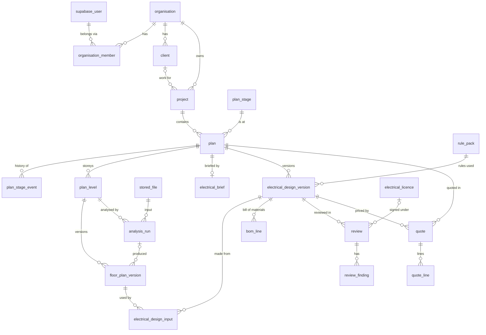

# Database schema

The Postgres schema behind Electriplan: who the customers are, what they work on, and where every
house plan is in its journey from an uploaded image to a quote.

- **DDL:** [`V2__core_domain.sql`](../backend/src/main/resources/db/migration/V2__core_domain.sql) and [`V3__licences_and_seats.sql`](../backend/src/main/resources/db/migration/V3__licences_and_seats.sql) in `backend/src/main/resources/db/migration` (Flyway, applied when the API starts)
- **Visual atlas:** [`documents/schema-atlas.html`](schema-atlas.html) — open it in a browser for an interactive diagram of every table, key and constraint ([how to rebuild it](../tools/schema-atlas/README.md))
- **Executable rules:** [`backend/src/test/resources/db/schema-rules.sql`](../backend/src/test/resources/db/schema-rules.sql), run in CI by `SchemaRulesPostgresTests`
- **Postgres:** 17 (uses `UNIQUE NULLS NOT DISTINCT`, so 15 or later)

---

## 1. The shape of it

```
organisation ─┬─ organisation_member ── supabase_user (copy of Supabase Auth)
 (the tenant) ├─ client
              ├─ project ─── plan ─┬─ plan_level ── floor_plan_version ◄── analysis_run ◄── stored_file
              │   (a site)  (a house)│   (a storey)       (FloorPlan JSON, versioned)
              │                      ├─ plan_stage_event   (lifecycle history)
              │                      ├─ electrical_brief
              │                      ├─ electrical_design_version ── bom_line
              │                      │       (ElectricalDesign JSON, versioned)
              │                      ├─ review ── review_finding
              │                      └─ quote ── quote_line  (one house, one committed design version)
              └─ catalogue_item, price_list
```



## 2. Decisions, and why

### 2.1 Multi-tenant, one database, isolated by row-level security

Every customer is an **organisation**. Every row an organisation creates carries `organisation_id`,
and **row-level security** limits every query to the organisation set for the transaction:

```sql
BEGIN;
SET LOCAL electriplan.organisation_id = '…';   -- the organisation the request is for
SET LOCAL electriplan.actor_id        = '…';   -- the signed-in Supabase user
-- queries…
COMMIT;
```

The API must do this at the start of every transaction (a Spring transaction listener is the natural
place), after checking the user is a member of that organisation. If it forgets, these tables
return **nothing**: the design fails closed, not open.

One database with RLS rather than a database or schema per tenant: it is far simpler to run,
migrate and back up, scales to thousands of organisations, and the isolation is enforced by Postgres
rather than by every query remembering a `WHERE`.

Two deliberate exceptions to "only the current organisation":

- with **no company chosen**, people can read their own memberships and the organisations they belong
  to, so the app can offer a company switcher. Once a company is chosen, even those disappear: inside
  a company, only that company is visible (V5);
- the **platform catalogue** (`catalogue_item` with no organisation) is readable by everyone and
  writable only in a transaction that sets `electriplan.platform_admin = 'on'`.

> **The API connects as an ordinary role** (since V4). Superusers bypass row-level security, so the
> API never uses the owner: it logs in as `electriplan_api`, a member of `electriplan_app`, which is
> `NOSUPERUSER NOBYPASSRLS`, owns nothing and cannot change the schema. Reference tables are
> read-only to it and history (`plan_stage_event`, `audit_event`) append-only. Flyway alone
> migrates as the owner. `ApplicationRolePostgresTests` proves each of these.

### 2.2 No cross-tenant references, by construction

Every table referenced by tenant data has `UNIQUE (organisation_id, id)`, and references go through
**both** columns:

```sql
FOREIGN KEY (organisation_id, project_id) REFERENCES electriplan.project (organisation_id, id)
```

So a plan in organisation B can never point at a project in organisation A, even if the application
passes the wrong id. This is checked by the database, not by code.

### 2.3 Floor plans and designs are JSON documents, versioned

The floor plan (`FloorPlan`) and the electrical design (`ElectricalDesign`) are stored whole, as
`jsonb`, in `floor_plan_version.document` and `electrical_design_version.document`:

- they are edited and saved as a unit by the editor, and only make sense as a unit (a door refers to
  a wall by id within the same document);
- exploding them into wall, room and point tables would mean keeping two representations in step for
  no query we need — lists and reports read the **summary columns** (`room_count`,
  `floor_area_m2`, `circuit_count`, `max_demand_a`…) that the API derives when it saves.

Each has **one editable draft** (`state = 'draft'`, enforced by a partial unique index) and any
number of **committed** versions. A trigger refuses any change to, or deletion of, a committed
version: it is history. Editing after a commit starts a new draft based on it
(`based_on_version_id`). So:

- a review always reviews an exact, frozen design (only committed designs can be reviewed);
- a quote prices one exact, committed design version of its house (`quote.design_version_id`);
- an electrical design records the exact floor-plan versions it was made from
  (`electrical_design_input`), plus the brief, rule pack, organisation policy and engine version —
  everything needed to reproduce it.

`lock_version` on drafts and plans is for optimistic locking: the API updates
`WHERE lock_version = :seen` and increments it, so two people editing at once cannot silently
overwrite each other.

### 2.4 The plan lifecycle is enforced by the database

`plan.stage` says where a house plan is. The stages are rows in `plan_stage`; the moves allowed
between them are rows in `plan_stage_transition`. A trigger refuses any other move, and every move
(including the first stage) is written to `plan_stage_event` with who made it
(`electriplan.actor_id`) and an optional note (`SET LOCAL electriplan.stage_note = '…'`).

```
awaiting_upload ─► analysing ─► floor_plan_review ─► floor_plan_approved ─► electrical_design
      ▲   │            │  ▲            ▲   │                                   │   ▲    ▲
      │   └────────────┼──┼────────────┘   │ (traced by hand)                  ▼   │    │
      └── (failed) ────┘  └── (re-analyse) ┘                          electrical_review │
                                                                      │       │       │
                                                     changes_requested ◄┘       ▼       │
                                                              └──────────► design_approved
                                                                                 │
                                         lost ◄── quote_sent ◄──► quoting ◄──────┘
                                                      │
                                                      └──► won

  Any working stage ──► on_hold ──► back to a working stage
  Any stage         ──► archived
```

Changing the workflow is a data change (rows in `plan_stage_transition`), not a code change. The
stage is per **plan**, not per project: a project with three house types can have one quoted and
two still in design.

### 2.5 Integrity rules live in the database

Things that must never be wrong are constraints or triggers, so no code path can get around them:

| Rule | Where |
|---|---|
| A plan only moves along an allowed transition | trigger `plan_check_stage` |
| One draft per level / per plan | partial unique indexes |
| Committed versions never change or disappear | trigger `protect_committed_version` |
| A design that breaks a mandatory rule cannot be committed | `CHECK (state <> 'committed' OR mandatory_violation_count = 0)` |
| Only committed designs can be reviewed | trigger `review_requires_committed_design` |
| One open review per design version | partial unique index |
| An approval is signed under a licence, recorded as it stood | `CHECK` on `review` |
| A rule pack is only released once a licensed electrician signed it off | `CHECK` on `rule_pack` |
| A quote is for one house and prices a committed design **of that house** | foreign key `(organisation_id, plan_id, design_version_id)`, trigger `quote_requires_committed_design` |
| One live (draft or sent) quote per house; revisions supersede | partial unique index `ux_quote_one_live_per_plan` |
| A company never uses more seats than its licence covers; viewers never use one; two requests cannot both take the last seat | trigger `enforce_seat_limit` (V3), `seats_in_use()` |
| A licence ends on or after it starts; a closed licence records when | `CHECK` on `organisation` (V3) |
| Quote totals = sum of lines, GST at the quote's rate | trigger `quote_recalculate`, `CHECK (total = subtotal + gst)` |
| A sent quote's lines never change; a sent quote is never deleted | triggers `quote_line_guard`, `quote_guard` |
| A house that has been quoted cannot be deleted (archive it) | foreign keys from `quote` |
| References between tenant rows stay within one organisation | composite foreign keys |

Every one of these is exercised by `schema-rules.sql` in CI.

### 2.6 Conventions

| Topic | Choice | Why |
|---|---|---|
| Primary keys | `uuid DEFAULT gen_random_uuid()` | Safe to expose, generated anywhere, no enumeration. Move to `uuidv7()` (Postgres 18) for better index locality when upgrading |
| History tables | `bigint GENERATED ALWAYS AS IDENTITY` | Append-only, ordered, compact |
| Human references | `PRJ-000042`, `Q-000107` from `electriplan.next_reference()`; a project gets its reference from a trigger when inserted without one (V7) | Gapless per organisation; people quote these on the phone |
| Codes | `text` + `CHECK`, or a lookup table | Values can be added or retired by migration; Postgres enums cannot drop a value |
| Money | `numeric(12,2)`, ex-GST and GST stored separately, `gst_rate` per quote | No floating point; the rate a quote was issued at never changes under it |
| Quantities, lengths | `numeric`; geometry in millimetres inside the documents | Exact |
| Time | `timestamptz` everywhere; `created_at`, `updated_at` (trigger-maintained) | |
| Deleting | `archived_at` for business records; committed history is never deleted | Undo, audit, and references from quotes keep working |
| Who did it | `created_by`, `actor_id`… are plain `uuid`s, not foreign keys | History must survive a user being deleted from Supabase |
| JSON | `jsonb` with `CHECK (jsonb_typeof(...) = 'object')`, and a `document_schema` version | Shape validated by the app against `contracts/*.schema.json`; the database guarantees it is at least an object |
| Files | Metadata in `stored_file`, bytes in object storage (`storage_backend`, `storage_key`), `sha256` for de-duplication and integrity | Keeps the database small; moving from local disk to S3 or Supabase Storage is a data change |

## 3. Tables

### People and tenancy

| Table | What it is |
|---|---|
| `supabase_user` *(V1)* | Read-only copy of Supabase Auth users. Supabase stays the source of truth for sign-in |
| `organisation` | A customer: name, slug, ABN, home state, settings, and its **licence**: status (trial / active / suspended / closed), `seat_limit`, licence period (`licence_starts_on`, `licence_ends_on`), `closed_at`. A trial is 3 seats for 14 days (V3) |
| `organisation_member` | User × organisation × role: `owner`, `admin`, `builder`, `electrician`, `viewer` |
| `organisation_invitation` | Pending invitations; only the SHA-256 of the token is stored |
| `user_profile` | Display name, default organisation, preferences |
| `electrical_licence` | A person's licence (state, class, number, expiry, verified). Reviews are signed under one |
| `organisation_counter` | Next number for project and quote references |

### Work

| Table | What it is |
|---|---|
| `client` | Who the work is for; billing details |
| `project` | A job at one site: reference, client, address, state (always given: no default, V7), distributor, supply phases, status; `last_activity_at` (the project or any of its houses last changed, by trigger, V7) orders the project list; `lock_version` for optimistic locking (V7) |
| `project_assignee` | Who is working on a project, and as what |
| `plan` | One house design in a project (a **house** in the app and API); carries `stage` and the current electrical design. Archiving a house sets `archived_at` and leaves its stage alone, so it can be restored |
| `plan_stage`, `plan_stage_transition` | The lifecycle: stages and the allowed moves |
| `plan_stage_event` | Every stage change: from, to, who, when, note |
| `plan_level` | A storey: name, ordinal (0 = ground), ceiling height, current floor-plan version |

### Floor plans

| Table | What it is |
|---|---|
| `stored_file` | Every uploaded or generated file: purpose, storage location (`s3`, key `organisations/<company>/files/<sha256>.<ext>`), type, size, hash, image size. A company's identical uploads are one file |
| `analysis_run` | One analyser run: input file, parameters, steps, warnings, error, timings. Recorded by the API for every upload, failed ones included. Its pointer to the file is checked at the end of the transaction (V9), so deleting a company deletes its files and runs together |
| `floor_plan_version` | The FloorPlan JSON for a level, versioned; scale and summary figures |

### Electrical

| Table | What it is |
|---|---|
| `electricity_distributor` | Reference: the five Victorian DNSPs, more states later |
| `rule_pack` | A released version of the engine's rules: standards editions, content hash, sign-off |
| `organisation_policy` | An organisation's design-policy overrides, versioned, one active |
| `electrical_brief` | The current brief for a plan: supply, construction, appliances, preferences |
| `electrical_design_version` | The ElectricalDesign JSON, versioned; brief snapshot, rule pack, engine version, figures |
| `electrical_design_input` | Which floor-plan versions a design was made from |
| `bom_line` | The bill of materials of a design version |

### Review

| Table | What it is |
|---|---|
| `review` | A request for a licensed electrician to review a committed design; status, decision, licence snapshot |
| `review_finding` | Per item: kept, moved, removed, added, changed, or a comment — the data behind the 90 % measure |

### Quotes

| Table | What it is |
|---|---|
| `catalogue_item` | Items designs use and quotes price: platform-wide or per organisation |
| `price_list`, `price_list_item` | An organisation's costs, prices and labour times |
| `quote` | A priced offer for **one house plan**, pricing one committed design version: reference and revision, status, totals, validity, client snapshot |
| `quote_line` | Lines: material, labour, other, discount; line total computed |

### Integration and audit

| Table | What it is |
|---|---|
| `external_reference` | This app's row ↔ the same thing in Planna One (quote, client, SKU) |
| `audit_event` | Append-only: who did what to which record, with the changes |

## 4. Typical queries

```sql
-- The project list, with how many plans are at each phase
SELECT p.reference, p.name, s.phase, count(*)
  FROM electriplan.project p
  JOIN electriplan.plan pl ON pl.project_id = p.id AND pl.archived_at IS NULL
  JOIN electriplan.plan_stage s ON s.code = pl.stage
 WHERE p.archived_at IS NULL
 GROUP BY p.reference, p.name, s.phase;

-- A plan's timeline
SELECT occurred_at, from_stage, to_stage, actor_id, note
  FROM electriplan.plan_stage_event WHERE plan_id = :plan ORDER BY occurred_at;

-- The floor plan the editor should open for a level
SELECT document FROM electriplan.floor_plan_version
 WHERE plan_level_id = :level
 ORDER BY (state = 'draft') DESC, version_no DESC LIMIT 1;

-- A house's quotes, newest first: the live one and the revisions before it
SELECT reference, revision, status, total_inc_gst
  FROM electriplan.quote WHERE plan_id = :plan ORDER BY revision DESC;

-- An electrician's open reviews
SELECT r.* FROM electriplan.review r
 WHERE r.reviewer_id = :me AND r.status IN ('requested', 'in_progress');
```

(Each runs inside a transaction that set `electriplan.organisation_id`.)

## 5. Later, when needed

- **Partition `audit_event`** (and `plan_stage_event` if it grows large) by month on its timestamp.
- **Search:** `pg_trgm` indexes on project, client and plan names when lists get long.
- **Storage limits per subscription plan:** a usage view over `stored_file.byte_size` by organisation.
- **More states:** rows in `electricity_distributor`; nothing structural.
- **Spatial queries** across plans (PostGIS) are not needed: geometry is only ever used whole, inside
  one document.

## 6. Open points for the team

1. **Runtime role** (2.1): create the non-superuser role and switch the API's connection to it before
   the first endpoint uses these tables.
2. **Who creates organisations?** Self-service sign-up creates an organisation with the person as owner;
   or invitation-only, as now. The schema supports both.
3. ~~Quote per project or per plan?~~ **Decided: per house plan.** Each quote prices one committed
   design version of one house, matching the plan lifecycle (quoting → quote sent → won / lost is per
   house). A project with three houses gets three quotes. If a combined quote is ever needed, it can
   be a document that bundles several per-house quotes, without changing these tables.
